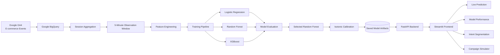
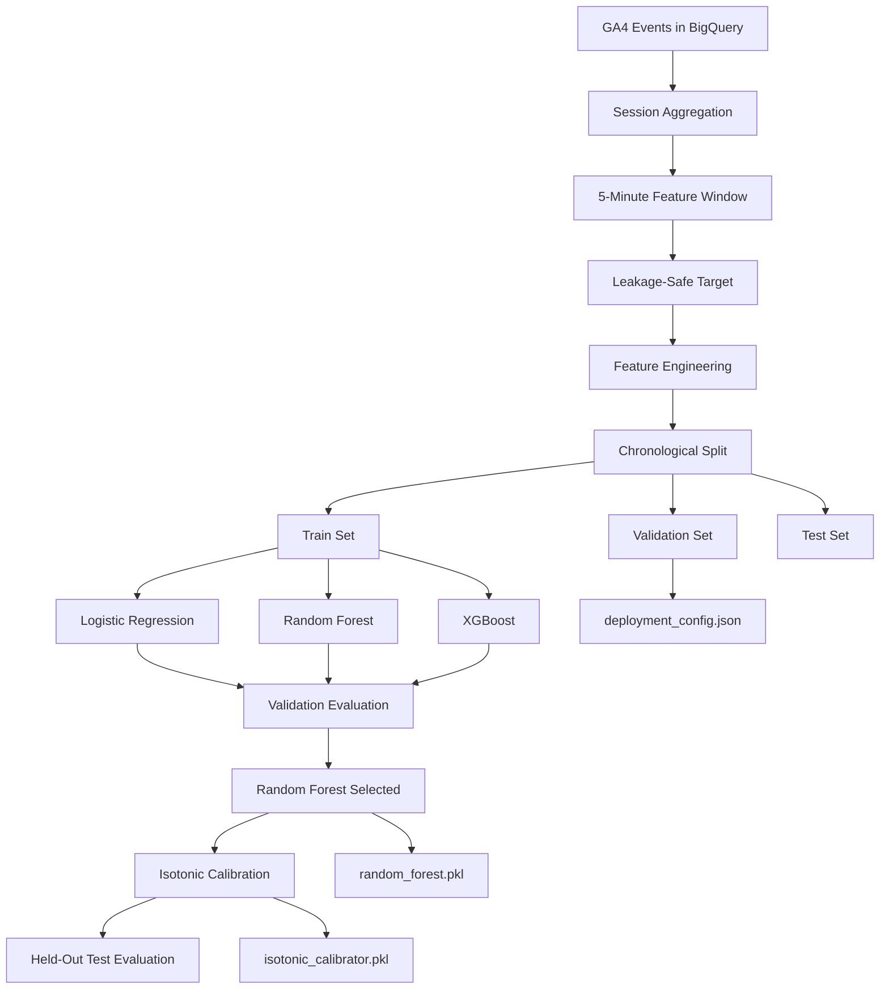
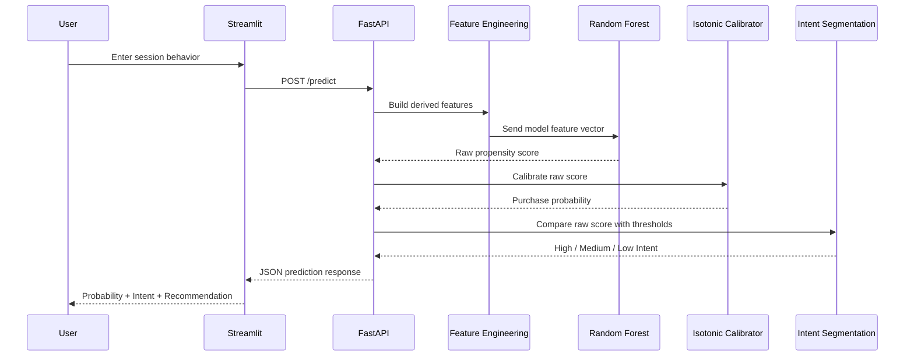
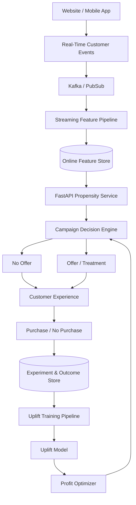
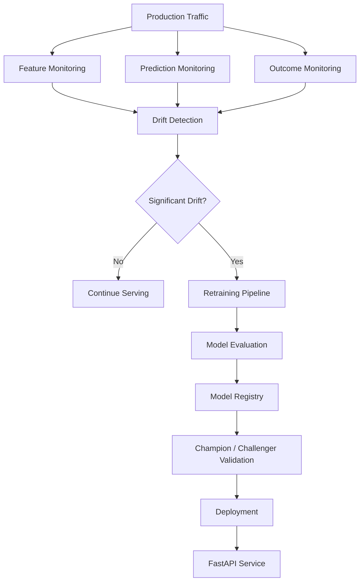

# E-commerce Conversion Propensity & Personalized Campaign Optimization

An end-to-end **Data Science and Machine Learning platform** that predicts e-commerce purchase propensity from the first five minutes of customer behavior, segments sessions by purchase intent, explains predictions with SHAP, serves the trained model through FastAPI, provides an interactive Streamlit dashboard, and evaluates campaign profitability.

---

## Project Highlights

| Area | Result |
|---|---:|
| Eligible modeling sessions | 359,603 |
| Final test sessions | 91,926 |
| Test conversion rate | 0.93% |
| ROC-AUC | **0.9520** |
| PR-AUC | **0.2577** |
| Log Loss | **0.0314** |
| Brier Score | **0.0076** |
| Lift @ Top 5% | **15.51×** |
| Recall @ Top 5% | **77.54%** |
| High-Intent traffic share | **5.0%** |
| Purchases from High-Intent group | **77.66%** |
| High-Intent conversion rate | **14.45%** |
| Illustrative campaign break-even uplift | **~0.594 pp** |

> **Key result:** The highest-scoring 5% of test sessions contained approximately **77.5% of eventual purchasers** and achieved approximately **15.5× lift** over the overall test conversion rate.

---

# Table of Contents

1. [Business Problem](#1-business-problem)
2. [Dataset](#2-dataset)
3. [Prediction Design](#3-leakage-safe-prediction-design)
4. [Features](#4-feature-engineering)
5. [Exploratory Data Analysis](#5-exploratory-data-analysis)
6. [Train Validation Test Strategy](#6-time-based-train-validation-test-strategy)
7. [Models Evaluated](#7-models-evaluated)
8. [Probability Calibration](#8-probability-calibration)
9. [Final Test Performance](#9-final-held-out-test-performance)
10. [Lift Analysis](#10-business-ranking--lift-analysis)
11. [Intent Segmentation](#11-intent-segmentation)
12. [Campaign Economics](#12-campaign-economics-simulator)
13. [Propensity vs Uplift](#13-propensity-vs-uplift)
14. [SHAP Explainability](#14-shap-explainability)
15. [System Architecture](#15-system-design-architecture)
16. [FastAPI Backend](#16-fastapi-backend)
17. [Streamlit Frontend](#17-streamlit-frontend)
18. [Repository Structure](#18-repository-structure)
19. [Installation](#19-installation)
20. [Running the Application](#20-running-the-application)
21. [Limitations](#21-limitations)
22. [Future Production Architecture](#22-future-production-architecture)
23. [Technology Stack](#23-technology-stack)
24. [Main Takeaway](#24-main-takeaway)

---

# 1. Business Problem

E-commerce platforms receive large volumes of traffic, but only a small fraction of sessions result in purchases.

Treating every customer equally can waste marketing budget because different users have very different levels of purchase intent.

For example:

- **High-intent users** may purchase without receiving a discount.
- **Medium-intent users** may be candidates for controlled promotional experiments.
- **Low-intent users** may remain unlikely to purchase even after receiving an offer.

The first question is:

> **Who is likely to purchase?**

This is a **purchase propensity** problem.

The second question is:

> **Who becomes more likely to purchase because of an intervention such as a discount?**

This is an **uplift / causal inference** problem.

This project primarily solves the purchase propensity problem and then adds a campaign economics layer to estimate how much incremental uplift would be required for an intervention to become profitable.

---

# 2. Dataset

The project uses Google's public GA4 sample e-commerce dataset available in BigQuery:

```text
bigquery-public-data.ga4_obfuscated_sample_ecommerce.events_*
```

## Data Period

```text
2020-11-01 to 2021-01-31
```

## Raw Dataset Statistics

| Metric | Value |
|---|---:|
| Total Events | 4,295,584 |
| Total Users | 270,154 |
| Observation Period | 92 days |

Important GA4 event types include:

```text
page_view
view_item
select_item
add_to_cart
begin_checkout
add_shipping_info
add_payment_info
purchase
```

---

# 3. Leakage-Safe Prediction Design

A major modeling decision was defining exactly **when prediction occurs**.

The system observes only:

> **The first five minutes of a customer session**

and predicts:

> **Whether the session purchases after minute five**

Sessions that had already purchased during the first five minutes were excluded because the outcome was already known at scoring time.

## Final Modeling Population

| Metric | Value |
|---|---:|
| Eligible Sessions | 359,603 |
| Converted Sessions | 4,322 |
| Non-Converted Sessions | 355,281 |
| Conversion Rate | 1.202% |

This is a severely imbalanced classification problem.

A model predicting `No Purchase` for almost every session could achieve very high accuracy, which is why **accuracy is not used as the main success metric**.

---

# 4. Feature Engineering

One row represents one eligible session.

## Raw Behavioral Features

```text
total_events_5min
page_views_5min
product_views_5min
product_clicks_5min
add_to_cart_5min
begin_checkout_5min
search_events_5min
```

## Customer and Context Features

```text
is_new_user
device_category
operating_system
traffic_source
traffic_medium
```

## Engineered Features

```text
is_returning_user
has_cart
has_checkout
has_product_view
has_product_click
product_views_per_page
click_per_product_view
cart_per_product_view
is_weekend
```

Identifiers such as:

```text
user_pseudo_id
session_id
```

are not used as predictive inputs.

---

# 5. Exploratory Data Analysis

EDA showed strong relationships between early-session behavior and conversion.

## Add-to-Cart Behavior

| Behavior | Sessions | Converted | Conversion Rate |
|---|---:|---:|---:|
| Added to Cart | 11,144 | 1,874 | **16.82%** |
| No Cart | 348,459 | 2,448 | **0.70%** |

Cart activity was strongly associated with purchase intent.

---

## Checkout Behavior

| Behavior | Sessions | Converted | Conversion Rate |
|---|---:|---:|---:|
| Started Checkout | 3,667 | 929 | **25.33%** |
| No Checkout | 355,936 | 3,393 | **0.95%** |

Checkout activity was one of the strongest late-funnel intent signals.

---

## New vs Returning Users

| User Type | Sessions | Converted | Conversion Rate |
|---|---:|---:|---:|
| Returning | 102,337 | 2,720 | **2.66%** |
| New | 257,266 | 1,602 | **0.62%** |

Returning sessions converted substantially more often.

---

## Product View Activity

| Product Views | Sessions | Conversions | Conversion Rate |
|---|---:|---:|---:|
| 0 | 290,945 | 443 | 0.15% |
| 1 | 32,067 | 518 | 1.62% |
| 2 | 14,280 | 572 | 4.01% |
| 3–4 | 12,243 | 983 | 8.03% |
| 5–9 | 8,225 | 1,336 | 16.24% |
| 10+ | 1,843 | 470 | 25.50% |

Conversion increased strongly with early product engagement.

These findings are **associations**, not proof of causality.

---

# 6. Time-Based Train Validation Test Strategy

A chronological split was used rather than a random split.

This better represents a production scenario where a model is trained on historical behavior and evaluated on future sessions.

| Split | Date Range | Sessions |
|---|---|---:|
| Training | Up to 2020-12-15 | 184,148 |
| Validation | 2020-12-16 to 2021-01-07 | 83,529 |
| Test | 2021-01-08 onward | 91,926 |

---

# 7. Models Evaluated

The following models were compared:

- Logistic Regression
- Random Forest
- XGBoost
- Tuned XGBoost

## Validation Performance

| Model | ROC-AUC ↑ | PR-AUC ↑ | Log Loss ↓ | Brier ↓ |
|---|---:|---:|---:|---:|
| Logistic Regression | 0.9518 | 0.2723 | 0.0305 | 0.0075 |
| **Random Forest** | **0.9545** | **0.2882** | 0.0298 | **0.0073** |
| XGBoost | 0.9526 | 0.2591 | 0.0303 | 0.0076 |
| Tuned XGBoost | 0.9544 | 0.2853 | **0.0297** | 0.0074 |

Random Forest was selected because it provided the strongest overall combination of:

- PR-AUC
- probability quality
- business ranking
- Brier Score
- Lift

The project does not assume that the most complex model must automatically be the best model.

---

# 8. Probability Calibration

Ranking users correctly is not enough.

For business use, predicted probabilities should also be reasonably reliable.

For example:

```text
Predicted Probability = 10%
```

should ideally mean that approximately 10% of comparable sessions convert.

Three approaches were compared:

| Method | Log Loss ↓ | Brier Score ↓ |
|---|---:|---:|
| Raw Random Forest | 0.020984 | 0.004840 |
| Platt Calibration | 0.023422 | 0.004739 |
| **Isotonic Calibration** | **0.019924** | **0.004616** |

Isotonic calibration produced the strongest calibration results.

## Prediction Flow

```text
Session Features
      ↓
Random Forest
      ↓
Raw Propensity Score
      ↓
Isotonic Calibration
      ↓
Calibrated Purchase Probability
```

---

# 9. Final Held-Out Test Performance

The final trained pipeline was evaluated on the held-out future test period.

| Metric | Result |
|---|---:|
| ROC-AUC | **0.9520** |
| PR-AUC | **0.2577** |
| Log Loss | **0.0314** |
| Brier Score | **0.0076** |
| Test Conversion Rate | **0.93%** |

The model retained strong ranking performance on later data.

Because the positive class represents less than 1% of the test population, metrics such as **PR-AUC, Lift, Recall@K, Log Loss and Brier Score** are more informative than accuracy alone.

---

# 10. Business Ranking / Lift Analysis

For many businesses, the most important question is not merely:

> Is the model accurate?

but:

> If I can target only a small percentage of users, how many future purchasers can I capture?

## Test Ranking Results

| Targeted Population | Sessions | Conversion Rate | Recall | Lift |
|---|---:|---:|---:|---:|
| Top 1% | 919 | 33.51% | 36.02% | **36.03×** |
| Top 5% | 4,596 | 14.43% | 77.54% | **15.51×** |
| Top 10% | 9,192 | 8.20% | 88.19% | **8.82×** |
| Top 20% | 18,385 | 4.34% | 93.33% | **4.67×** |
| Top 30% | 27,577 | 2.94% | 94.74% | **3.16×** |

> **Targeting only the highest-scoring 5% of sessions captured approximately 77.5% of purchasers.**

---

# 11. Intent Segmentation

Sessions are ranked by the underlying Random Forest propensity score.

The project defines:

```text
High Intent   = Top 5%
Medium Intent = Next 15%
Low Intent    = Remaining 80%
```

## Final Test Segmentation

| Segment | Sessions | Session Share | Purchases | Purchase Share | Actual Conversion | Predicted Conversion |
|---|---:|---:|---:|---:|---:|---:|
| **High Intent** | 4,596 | 5.00% | 664 | **77.66%** | **14.45%** | 12.93% |
| Medium Intent | 13,789 | 15.00% | 134 | 15.67% | 0.97% | 0.99% |
| Low Intent | 73,541 | 80.00% | 57 | 6.67% | 0.078% | 0.089% |

The High-Intent group represents only about 5% of traffic but contains nearly 78% of all purchases.

---

## Business Interpretation

### High Intent

```text
5% of sessions
77.7% of purchases
14.45% conversion
```

Potential strategy:

```text
Avoid unnecessary blanket discounts
Reduce checkout friction
Provide relevant recommendations
Use cart / checkout reminders
Preserve margin when possible
```

### Medium Intent

```text
15% of sessions
15.7% of purchases
0.97% conversion
```

Potential strategy:

```text
Controlled campaign experiments
A/B testing
Personalized incentives
Measure incremental uplift
```

### Low Intent

```text
80% of sessions
6.7% of purchases
0.078% conversion
```

Potential strategy:

```text
Product discovery
Remarketing
Engagement
Retargeting
Avoid automatically giving discounts
```

Low purchase propensity does **not** imply that a discount will change customer behavior.

---

# 12. Campaign Economics Simulator

A campaign economics simulator was built to move beyond simple classification.

The business question is:

> **How much must a promotion increase conversion before the promotion becomes profitable?**

## Illustrative Assumptions

| Input | Value |
|---|---:|
| Gross Margin per Order | ₹600 |
| Discount per Converted Order | ₹100 |
| Campaign Cost per Targeted Session | ₹2 |

Medium-Intent baseline conversion:

```text
0.972%
```

Under the example economics, the campaign requires approximately:

```text
+0.594 percentage points
```

of incremental conversion uplift to reach break-even.

Required conversion therefore becomes approximately:

```text
0.972% + 0.594% = 1.566%
```

This corresponds to roughly:

```text
82 additional purchases
```

for the Medium-Intent population under the stated assumptions.

These are **scenario assumptions**, not measured causal treatment effects.

---

# 13. Propensity vs Uplift

This distinction is central to the project.

## Propensity

Answers:

> **Who is likely to purchase?**

Conceptually:

```text
P(Purchase | Customer Behavior)
```

This is what the Random Forest predicts.

---

## Uplift

Answers:

> **Whose probability of purchasing changes because of an intervention?**

Conceptually:

```text
Uplift(x)
=
P(Purchase | Treatment, x)
-
P(Purchase | No Treatment, x)
```

Example:

```text
Without Discount = 10%
With Discount    = 30%

Incremental Uplift = +20 percentage points
```

A future randomized A/B experiment could provide treatment/control data for uplift modeling.

---

# 14. SHAP Explainability

SHAP was used to explain the underlying Random Forest propensity model.

SHAP stands for:

```text
SHapley Additive exPlanations
```

It provides two useful levels of explanation.

## Global Explainability

Answers:

> Which features influence the model most overall?

Important behavioral signals included:

```text
Checkout behavior
Add-to-cart activity
Product engagement
Product views
Total session activity
Returning-user behavior
```

## Local Explainability

Answers:

> Why did this individual session receive a high or low score?

A:

```text
Positive SHAP value
```

pushes the prediction toward higher purchase propensity.

A:

```text
Negative SHAP value
```

pushes the prediction toward lower purchase propensity.

SHAP explains **how the model behaves**. It does not prove causal relationships.

---

# 15. System Design Architecture

The project is designed as a multi-layer conversion intelligence platform.

## High-Level System Architecture



---

## Architecture Layers

```text
┌───────────────────────────────────────────────────────┐
│                  DATA SOURCE LAYER                    │
│                                                       │
│            Google Analytics 4 Events                  │
└─────────────────────────┬─────────────────────────────┘
                          │
                          ▼
┌───────────────────────────────────────────────────────┐
│               DATA ENGINEERING LAYER                  │
│                                                       │
│                  Google BigQuery                      │
│                         │                             │
│                         ▼                             │
│                 Session Aggregation                   │
│                         │                             │
│                         ▼                             │
│             First 5-Minute Window                     │
│                         │                             │
│                         ▼                             │
│                 Feature Engineering                   │
└─────────────────────────┬─────────────────────────────┘
                          │
                          ▼
┌───────────────────────────────────────────────────────┐
│               MACHINE LEARNING LAYER                  │
│                                                       │
│ Logistic Regression ──┐                               │
│ Random Forest ────────┼──► Model Comparison           │
│ XGBoost ──────────────┘           │                   │
│                                   ▼                   │
│                         Random Forest Selected         │
│                                   │                   │
│                                   ▼                   │
│                         Isotonic Calibration           │
│                                   │                   │
│                                   ▼                   │
│                              SHAP                     │
└─────────────────────────┬─────────────────────────────┘
                          │
                          ▼
┌───────────────────────────────────────────────────────┐
│                    SERVING LAYER                      │
│                                                       │
│ random_forest.pkl                                     │
│ isotonic_calibrator.pkl                               │
│ deployment_config.json                                │
│                         │                             │
│                         ▼                             │
│                     FastAPI                           │
│                                                       │
│ GET  /health                                          │
│ GET  /model-info                                      │
│ POST /predict                                         │
└─────────────────────────┬─────────────────────────────┘
                          │
                          │ REST API
                          ▼
┌───────────────────────────────────────────────────────┐
│                 PRESENTATION LAYER                    │
│                                                       │
│                    Streamlit                          │
│                                                       │
│    ┌─────────────────────────────────────────────┐    │
│    │ Live Prediction                             │    │
│    ├─────────────────────────────────────────────┤    │
│    │ Model Performance                           │    │
│    ├─────────────────────────────────────────────┤    │
│    │ Intent Segmentation                         │    │
│    ├─────────────────────────────────────────────┤    │
│    │ Campaign Profit Simulator                   │    │
│    └─────────────────────────────────────────────┘    │
└───────────────────────────────────────────────────────┘
```

---

## Offline Training Architecture



---

## Live Inference Architecture



---

## Live Prediction Pipeline

```text
Raw Session Input
        │
        ▼
Backend Feature Engineering
        │
        ▼
20 Model Features
        │
        ▼
ColumnTransformer
        │
        ├── StandardScaler
        │
        └── OneHotEncoder
        │
        ▼
Random Forest
        │
        ▼
Raw Propensity Score
        │
        ├───────────────────────────┐
        │                           │
        ▼                           ▼
Isotonic Calibration        Intent Thresholds
        │                           │
        ▼                           ▼
Purchase Probability       High / Medium / Low
        │                           │
        └──────────────┬────────────┘
                       ▼
                  API Response
                       │
                       ▼
               Streamlit Dashboard
```

---

## Model Artifact Architecture

```text
models/
│
├── random_forest.pkl
│
│   Contains the Scikit-learn pipeline:
│
│   ├── ColumnTransformer
│   │   ├── StandardScaler
│   │   └── OneHotEncoder
│   │
│   └── RandomForestClassifier
│
├── isotonic_calibrator.pkl
│
│   Raw Random Forest score
│               ↓
│   Calibrated purchase probability
│
└── deployment_config.json
    │
    ├── High-Intent score threshold
    ├── Medium-Intent score threshold
    └── Intent-segmentation rules
```

Keeping preprocessing inside the serialized Scikit-learn pipeline reduces the risk of training-serving transformation mismatch.

---

# 16. FastAPI Backend

The model is exposed through a REST API.

## Endpoints

```text
GET  /
GET  /health
GET  /model-info
POST /predict
```

## Example Request

```json
{
  "session_date": "2021-01-15",
  "total_events_5min": 18,
  "page_views_5min": 7,
  "product_views_5min": 5,
  "product_clicks_5min": 2,
  "add_to_cart_5min": 1,
  "begin_checkout_5min": 1,
  "search_events_5min": 0,
  "is_new_user": 0,
  "device_category": "desktop",
  "operating_system": "Macintosh",
  "traffic_source": "google",
  "traffic_medium": "organic"
}
```

## Example Response Structure

```json
{
  "raw_propensity_score": 0.12,
  "purchase_probability": 0.14,
  "purchase_probability_pct": 14.0,
  "intent_segment": "High Intent"
}
```

The example numerical values above are illustrative.

---

# 17. Streamlit Frontend

The Streamlit dashboard contains four major sections.

## Live Prediction

Allows a user to enter first-five-minute session behavior and obtain:

```text
Purchase probability
Raw propensity score
Intent segment
Business recommendation
```

## Model Performance

Displays:

```text
ROC-AUC
PR-AUC
Lift
Recall
Log Loss
Brier Score
```

## Intent Segmentation

Displays:

```text
High Intent
Medium Intent
Low Intent
```

along with session share, purchase share and conversion rates.

## Campaign Simulator

Allows users to change:

```text
Gross margin
Discount amount
Campaign cost
Expected conversion uplift
```

and dynamically calculates:

```text
Baseline orders
Expected campaign orders
Baseline profit
Campaign profit
Incremental profit
Break-even uplift
```

---

# 18. Repository Structure

```text
.
├── backend/
│   ├── main.py
│   ├── predictor.py
│   └── schemas.py
│
├── frontend/
│   └── app.py
│
├── models/
│   ├── random_forest.pkl
│   ├── isotonic_calibrator.pkl
│   └── deployment_config.json
│
├── notebooks/
│   ├── 01_eda.ipynb
│   ├── 02_feature_engineering.ipynb
│   ├── 03_logistic_regression.ipynb
│   └── Deployed.ipynb
│
├── reports/
│   └── final_metrics.json
│
├── requirements.txt
├── .gitignore
└── README.md
```

---

# 19. Installation

Clone the repository:

```bash
git clone <YOUR_GITHUB_REPOSITORY_URL>
```

Move into the project directory:

```bash
cd E-commerce-Conversion-Propensity-Personalized-Offer-Optimization
```

Install dependencies:

```bash
python3 -m pip install -r requirements.txt
```

---

# 20. Running the Application

## Start FastAPI

From the project root:

```bash
python3 -m uvicorn backend.main:app --reload --port 8001
```

Swagger documentation:

```text
http://127.0.0.1:8001/docs
```

Health endpoint:

```text
http://127.0.0.1:8001/health
```

Model information:

```text
http://127.0.0.1:8001/model-info
```

---

## Start Streamlit

Open another terminal from the project root:

```bash
python3 -m streamlit run frontend/app.py
```

Then open:

```text
http://localhost:8501
```

---

# 21. Limitations

The project has several important limitations.

### Historical Data

The model is trained on sample e-commerce behavior from 2020–2021.

A real production system should monitor:

```text
Data drift
Feature drift
Prediction drift
Calibration drift
Conversion-rate drift
```

### Campaign Economics

The campaign simulator uses illustrative assumptions.

Actual production decisions should use real:

```text
Product margins
Discount costs
Media costs
Campaign costs
Customer lifetime value
```

### No Randomized Promotion Experiment

The GA4 dataset does not contain randomized promotion treatment/control assignments.

Therefore the project cannot claim that discounts **cause** additional purchases.

### SHAP Is Not Causal

SHAP explains how the model uses features.

It does not prove that changing a feature will cause conversion.

---

# 22. Future Production Architecture

The current project is an offline ML + API + dashboard application.

A production-scale version could evolve into the following architecture.



---

## Future MLOps Architecture



Potential production extensions include:

```text
MLflow experiment tracking
Model registry
Docker
Kubernetes
CI/CD
Feature store
Real-time streaming
Data-quality monitoring
Model monitoring
Calibration monitoring
Automatic retraining
Champion/challenger deployment
Live SHAP explanations
A/B testing platform
Uplift modeling
Product-level propensity
Recommendation engine integration
```

---

# 23. Technology Stack

| Layer | Technologies |
|---|---|
| Data Source | Google Analytics 4 |
| Warehouse | Google BigQuery |
| Querying | SQL |
| Data Processing | Python, Pandas, NumPy |
| Machine Learning | Scikit-learn, Random Forest, Logistic Regression, XGBoost |
| Calibration | Isotonic Regression |
| Explainability | SHAP |
| Visualization | Matplotlib, Streamlit |
| Backend | FastAPI, Pydantic, Uvicorn |
| Model Serialization | Joblib |
| Frontend | Streamlit |
| API Communication | Requests |
| Version Control | Git, GitHub |

---

# 24. Main Takeaway

This project demonstrates that a strong Data Science solution should go beyond simply training a classifier.

The complete decision framework is:

```text
Customer Behavior
        ↓
Purchase Propensity
        ↓
Probability Calibration
        ↓
Intent Segmentation
        ↓
Business Economics
        ↓
A/B Experimentation
        ↓
Incremental Uplift
        ↓
Profit Optimization
```

Using only behavior observed during the first five minutes of a session, the final model achieved:

```text
ROC-AUC = 0.952
PR-AUC  = 0.258
```

and the highest-scoring:

```text
5% of sessions
```

captured approximately:

```text
77.5% of purchasers
```

with approximately:

```text
15.5× Lift
```

over the overall test conversion rate.

The final platform combines:

```text
Data Engineering
+
Feature Engineering
+
Machine Learning
+
Probability Calibration
+
Business Ranking
+
Intent Segmentation
+
Campaign Economics
+
Explainability
+
REST API Serving
+
Interactive Frontend
```

to create an end-to-end **E-commerce Conversion Intelligence Platform**.